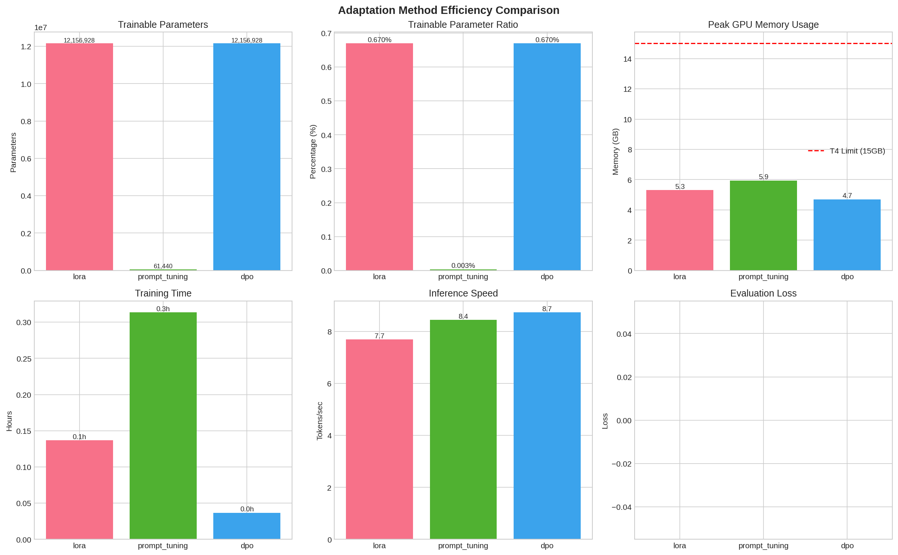
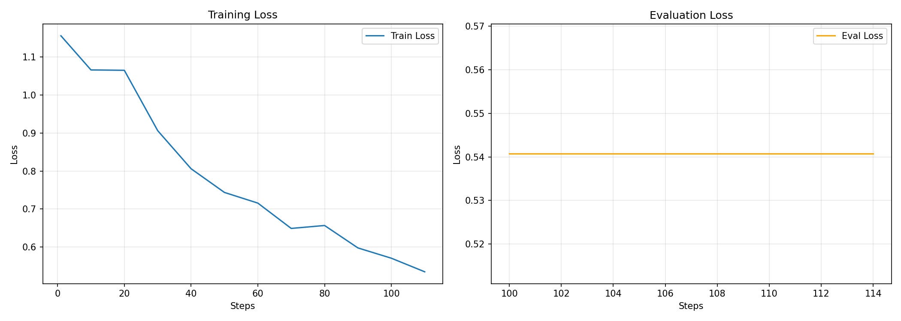

# Synthetic Instruction Tuner

A complete low-cost LLM fine-tuning pipeline built on Google Colab: generate 1,500 synthetic instruction-response pairs with Magpie prompting, quality-filter them to 1,000, build 600 reward-model-scored preference pairs, then train and compare **LoRA**, **Prompt Tuning**, and **DPO** on Llama-3.2-3B — with all datasets, trained adapters, and measurements committed in this repo.

[](https://www.python.org/downloads/)
[](https://colab.research.google.com/)
[](https://huggingface.co/meta-llama/Llama-3.2-3B)
[](https://opensource.org/licenses/MIT)

---

## Results (every number traces to a committed artifact)

| Method | Trainable params* | Val loss | Peak GPU mem | Train time (A100) | Inference |
|---|---|---|---|---|---|
| **LoRA SFT** (r=8) | 12,156,928 (0.67%) | **0.54** | 5.3 GB | 8.2 min | 7.7 tok/s |
| **Prompt Tuning** (20 virtual tokens) | 61,440 (0.003%) | 2.98 | 5.9 GB | 18.8 min | 8.4 tok/s |
| **DPO** (on top of SFT) | 12,156,928 (0.67%) | 0.55 (DPO loss) | **4.7 GB** | **2.2 min** | **8.7 tok/s** |

\*Percentages as PEFT counted them on the 4-bit-loaded model; LoRA is about 0.38% of the full 3.2B Llama-3.2-3B. Sources: `evaluation/metrics/{lora,prompt_tuning,dpo}_metrics.json` (memory, time, throughput) and `models/{sft,dpo,prompt_tuning}/final/training_config.json` (losses). Step counts cross-check the data: 900 SFT samples x 3 epochs / effective batch 24 = 114 recorded steps; 540 DPO pairs / effective batch 16 = 34 recorded steps.

**What the numbers say:**

- **LoRA reached 5.5x lower validation loss than Prompt Tuning (0.54 vs 2.98)** on identical data and hardware — the 198x larger adapter budget clearly paid off at this model scale.
- **Single-epoch DPO trained in ~2 minutes at 4.7 GB peak memory** (540 training pairs, beta=0.1). Held-out DPO loss reached 0.55, down from the 0.693 (ln 2) it starts at when the policy equals the reference. This is a preference loss, not comparable to SFT's 0.54 cross-entropy.
- **Data pipeline is fully materialized in-repo**: 1,500 generated pairs → 1,258 passed the 6-filter QC (83.9% pass rate, mean quality score 0.88) → top 1,000 kept → 600 preference pairs whose reward margins (mean 1.78, min 0.53) all clear the 0.5 selection gate.
- **Fine-tuning changed response behavior** (measured over the 10 qualitative probes in `evaluation/results/evaluation_summary.json`): DPO responses are +21% longer (139.6 vs 115.8 words), use +67% more unique words, and pack content into 36% fewer sentences than the base model.



*Parameter, memory, speed, and loss comparison across methods, generated from the committed metrics files.*

### Integrity note: benchmark scores removed

Earlier versions of this README (and derived CV lines) reported MMLU / HellaSwag / ARC-Easy / TruthfulQA scores with a "57.5% average, +9.7 points over zero-shot" headline. A source audit showed those exact numbers are a hardcoded **"sample benchmark data for demonstration"** fallback inside `notebooks/09_comparative_analysis.ipynb` — no notebook in this repo actually runs those benchmarks. They have been removed from this README and derived claims; everything above is measured. One caveat: the same demo-fallback numbers still sit inside committed artifacts — `evaluation/metrics/full_comparison_report.json` (the `benchmark_results` block and the `"Best Performance: DPO (57.5% avg)"` key finding), `evaluation/metrics/comparison_summary.csv` (the `Avg Benchmark` column), and the `evaluation/figures/benchmark_comparison.png` / `tradeoff_analysis.png` figures — all produced from notebook 09's hardcoded sample data, not a measured run, so do not cite them. Running `lm-eval-harness` (already in `requirements.txt`) against the committed adapters is the honest next step.

---

## Quick Start

Clone the repository:

```bash
git clone https://github.com/CY-HYUN/Synthetic-Instruction-Tuner.git
cd Synthetic-Instruction-Tuner
```

### Inspect the results — no GPU needed

Datasets, adapters, and all measurements are committed (~167 MB), so you can verify every claim locally with the Python standard library:

```bash
python -m json.tool evaluation/metrics/dpo_metrics.json
python -m json.tool models/dpo/final/training_config.json
python -c "import json; d=json.load(open('data/preference/preference_data.json', encoding='utf-8')); print(len(d), 'preference pairs; first margin =', round(d[0]['margin'], 3))"
```

### Use the trained adapters (GPU + gated-model access required)

The final LoRA adapters are committed at `models/sft/final/` and `models/dpo/final/` (~47 MB each). Loading them requires a CUDA GPU, `pip install -r requirements.txt`, and a Hugging Face token with access to the gated [meta-llama/Llama-3.2-3B](https://huggingface.co/meta-llama/Llama-3.2-3B):

```python
from transformers import AutoModelForCausalLM, AutoTokenizer
from peft import PeftModel

base = AutoModelForCausalLM.from_pretrained(
    "meta-llama/Llama-3.2-3B", load_in_4bit=True, device_map="auto"
)
model = PeftModel.from_pretrained(base, "models/dpo/final")   # or "models/sft/final"
tokenizer = AutoTokenizer.from_pretrained("models/dpo/final")
```

Note: the prompt-tuning adapter weights are **not** committed (only its config/tokenizer files are); rerun `notebooks/05b_prompt_tuning.ipynb` to recreate them.

### Reproduce the full pipeline (Colab)

The notebooks are Colab-native: they mount Google Drive and read paths from `config.json` (`/content/drive/MyDrive/synthetic-instruction-tuner/...`). To reproduce:

1. Copy this folder to Google Drive as `MyDrive/synthetic-instruction-tuner/`.
2. Add `HF_TOKEN` to Colab secrets (needs Llama gated-model access).
3. Run the notebooks in order — each stage consumes the previous stage's outputs:

| # | Notebook | What it does | Output |
|---|----------|--------------|--------|
| 01 | `01_setup.ipynb` | Environment, dependencies, config | — |
| 02 | `02_magpie_generation.ipynb` | Magpie generation with Llama-3.1-8B-Instruct (4-bit) | `data/raw/instructions_raw.json` (1,500) |
| 03 | `03_quality_filtering.ipynb` | 6-filter QC, keep top 1,000 | `data/filtered/` |
| 04 | `04_preference_generation_STABLE_OPTIMIZED.ipynb` | Multi-temperature sampling + reward-model scoring | `data/preference/` (600 pairs) |
| 05 | `05_sft_training.ipynb` | LoRA SFT, 3 epochs | `models/sft/final/` |
| 05b | `05b_prompt_tuning.ipynb` | Prompt Tuning comparison arm | `models/prompt_tuning/final/` |
| 06 | `06_dpo_training.ipynb` | DPO alignment, 1 epoch | `models/dpo/final/` |
| 07 | `07_benchmark_evaluation.ipynb` | Qualitative probes: instruction following, knowledge, response metrics | `evaluation/results/` |
| 08 | `08_agent_evaluation.ipynb` | Agent-capability probes (planning, multi-turn, feedback) | `evaluation/results/` |
| 09 | `09_comparative_analysis.ipynb` | Aggregate metrics, figures, comparison report | `evaluation/metrics/`, `evaluation/figures/` |

Approximate cost of the original run: ~200 Colab compute units, mixing the free T4 tier (generation, filtering) with A100 Pro tier (training). Long generation jobs checkpoint every 100 samples to survive Colab disconnects. Running fully local instead of Colab requires editing the Drive paths in `config.json` and the `google.colab` imports.

---

## Pipeline Architecture

```
Magpie generation ──► Quality filtering ──► Preference pairs ──► SFT ──► DPO ──► Evaluation
Llama-3.1-8B-Instruct   6 rule-based filters   4 temperatures        LoRA r=8   beta=0.1   qualitative probes
(4-bit, template-only)  weighted score >= 0.5  (0.6/0.8/1.0/1.2)     alpha=16   1 epoch    + efficiency metrics
1,500 pairs             1,258 pass (83.9%)     reward margin >= 0.5  3 epochs   lr 5e-5    + figures
                        top 1,000 kept         600 pairs             lr 2e-4
                                                     │
                                                     └──► Prompt Tuning (20 tokens) as the comparison arm
```

- **Magpie generation**: the chat template is sent with an empty user turn; the instruct model generates *both* the instruction and the response. No seed data, no API costs.
- **Quality filtering** (`src/filtering/quality_filter.py`): six rule-based checks — length, language, repetition, format, toxicity, content quality — combined as a weighted score (weights 0.15/0.10/0.20/0.15/0.15/0.25, threshold 0.5). Failure breakdown from `evaluation/results/filtering_stats.json`: repeated phrases 156, too short 76, harmful content 5, refusals 5.
- **Preference generation** (`src/preference/preference_generator.py` + notebook 04): sample 4 responses per instruction at temperatures 0.6–1.2, score each with `OpenAssistant/reward-model-deberta-v3-large-v2`, keep best-vs-worst pairs only when the reward margin is ≥ 0.5.
- **Training**: LoRA (r=8, alpha=16, dropout 0.05, all 7 linear projections) and Prompt Tuning (20 virtual tokens) on the same 900/100 split; DPO (beta=0.1, lr 5e-5, single epoch) on the 540/60 preference split, with the frozen SFT model as reference.

### Repository layout

```
Synthetic-Instruction-Tuner/
├── notebooks/          # 01-09 pipeline notebooks (+ archive/ of earlier 04 variants)
├── src/                # QualityFilter and PreferenceGenerator modules
├── data/               # committed datasets: raw (1,500), filtered (1,000), preference (600)
├── models/             # sft/final + dpo/final adapters (committed); prompt_tuning/final configs
├── evaluation/         # figures/ (7 PNG), metrics/ (JSON+CSV), results/ (JSON)
├── docs/               # DETAILS.md (methodology deep-dive) + plan/requirements/tech-stack docs
├── config.json         # central config: models, hyperparameters, Colab Drive paths
└── requirements.txt
```

---

## Key Findings

1. **Adapter capacity dominated at 3B scale.** Prompt Tuning's 61K parameters could not fit the instruction distribution (val loss 2.98 vs LoRA's 0.54) despite training longer (18.8 vs 8.2 min). At this model size, LoRA's extra 12.1M parameters were worth it.
2. **DPO is cheap once you have SFT.** One epoch over 540 preference pairs took 34 optimizer steps (~2 min) and the lowest peak memory of all three methods (4.7 GB with 4-bit dual-model loading). Its 0.55 is DPO loss on 60 held-out pairs, a different quantity from SFT's 0.54 cross-entropy.
3. **A margin gate materially changes preference data.** Requiring reward margin ≥ 0.5 yielded pairs with mean margin 1.78 — the committed `preference_data.json` shows a minimum margin of 0.53, i.e. the gate was genuinely enforced, not aspirational.
4. **Rule-based filtering was enough for synthetic data QC.** 83.9% of Magpie outputs passed six interpretable filters; the dominant failure mode was phrase repetition (156 of 242 failures), not toxicity (5).
5. **Fine-tuning changed style measurably even with 1,000 samples**: longer, denser, lexically richer responses on held-out probes (+21% length, +67% unique words, −36% sentence count for DPO vs base).



More depth — filter design, Magpie template mechanics, hyperparameter rationale, troubleshooting log, and a claim-by-claim data-provenance table — in **[docs/DETAILS.md](docs/DETAILS.md)**.

---

## Tech Stack

- **Models**: Llama-3.1-8B-Instruct (data generator, 4-bit NF4), Llama-3.2-3B (fine-tuning base), OpenAssistant reward-model-deberta-v3-large-v2 (preference scoring)
- **Training**: PyTorch, Hugging Face Transformers, PEFT (LoRA, Prompt Tuning), TRL (DPO), bitsandbytes (4-bit quantization)
- **Evaluation & analysis**: pandas, numpy, matplotlib, seaborn
- **Infrastructure**: Google Colab (free T4 + A100 Pro tier), checkpoint-based recovery for 12-hour session limits

## Limitations (honest)

- **No measured standard-benchmark scores yet** — see the integrity note above. `lm-eval` is installed by the notebooks but was never run; the qualitative evaluation covers only 10 probes.
- **Colab-native notebooks**: paths in `config.json` point at Google Drive; local execution needs edits.
- **Prompt-tuning adapter weights not committed** (excluded by `.gitignore`); only SFT and DPO adapters ship with the repo.
- **Known config drift**: `config.json` lists a `response_models` trio and a 0.8/0.2 split that the actually-used notebook 04 and the committed splits (900/100, 540/60) do not reflect. The committed artifacts and notebook 04 are authoritative; see docs/DETAILS.md.

## License

MIT — see [LICENSE](LICENSE).
